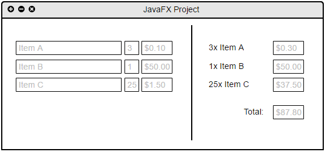

COMP204-16B / COMP242-16B Assignment 3
======================================

Due on **Sunday, 14th August at 11:30pm**.


Experimenting with a big Java Package – JavaFX
==============================================

The goal of this exercise is learn about the JavaFX system for building user interfaces.
JavaFX is the recommended library for making user interfaces in desktop applications with 
Java 8 (the current version of the Java language and development system).

JavaFX is described in the [documentation supplied by Oracle, found here](http://docs.oracle.com/javase/8/).

This assignment is comprised of 3 parts:
 1. Writing a basic "Hello World" JavaFX program guided by documentation
 2. Creating a basic form using JavaFX guided by documentation
 3. Beginning a more complex project that leverages what you learned in the first two parts
 
**You will update this document as part of the tasks.**


Preamble
========

1. Fork this repository using the button at the top of the page.
  * Set the visibility level of the project to Private.
2. Clone your new repository to your computer using Git.
3. Remember to commit and push regularly!


Task 1
======

To begin, open the JavaFX\_Hello\_World project with your IDE and the [JavaFX Hello World tutorial, found here](https://docs.oracle.com/javase/8/javafx/get-started-tutorial/hello_world.htm) in a browser.

* Work through the Hello World code and implement it in your project. Resist the temptation to copy and paste the code from the tutorial page, it will help to type it out by hand.
* Come up with three questions you have about your solution and detail them below. These questions should be different to those covered during the lectures.
* Modify your solution to attempt to answer your questions. Update your questions below to indicate how you went about answering the question and what the answer was.

Task 1 Questions
----------------

```
----------- Need to Come Back to this. ----------
```

Task 2
======

To begin, open the JavaFX\_Form\_Design project with your IDE and the [JavaFX Form Creation tutorial, found here](https://docs.oracle.com/javase/8/javafx/get-started-tutorial/form.htm) in a browser.

* Work through the tutorial and implement it in your project. Resist the temptation to copy and paste the code from the tutorial page, it will help to type it out by hand.
* Come up with three questions you have about your solution and detail them below. **These questions should differ from those used in Task 1**.
* Modify your solution to attempt to answer your questions. Update your questions below to indicate how you went about answering the question and what the answer was.

Task 2 Questions
----------------

```
----------- Need to Come Back to this. ----------
```

Task 3
======

In the JavaFX\_Project project, write an application that takes a list of 3 products, quantities and unit costs; and produces a receipt reflecting that information.  
In addition, the generated receipt prices should be editable. A mockup of what you will be building is shown below.



You will need to split the window into halves. On the left-hand side you should
have 3 rows of 3 input fields. These fields should allow for setting a product
name, quantity and unit cost for each row. On the right you should have a 
non-editable representation of each row's product name and quantity, and an 
editable field that contains the total cost for that row.  Also on the 
right-hand side there should be a non-editable total field that contains the sum
of the totals on the right side.

When a field on the left-hand side is modified, the appropriate fields on the right-hand
side should be updated. This will involve copying the product name and quantity to 
the non-editable fields, and calculating the row cost by multiplying the unit cost 
by quantity then updating the editable cost field to display this value. When the 
right-hand editable fields change, the total field should also be updated.


Submission
==========

Upload a zipped copy of your repository to [moodle in the assignment submission](https://elearn.waikato.ac.nz/mod/assign/view.php?id=566698). 
Please download the zip from GitLab using the download button in the top right 
of the project view rather than zipping it from the copy on your local hard drive.


Grading
=======

| Weighting | Allocated to |
|:----------:|------|
| 10% | Correct repository usage and settings |
| 20% | Task 1 code, questions and modifications |
| 20% | Task 2 code, questions and modifications |
| 40% | Task 3 implementation |
